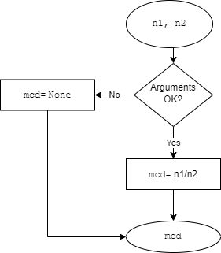

# **`substractions`**

Specification file for `substractions` function.

 

## 1. Requirements
---

### 1.1 ID
---
> f_004

 

### 1.2 Signature
---
> `mcd = substractions(n1, n2)`

 

### 1.3 Type and language
---
> Python function

 

### 1.4 Purpose
---
> Returns the division of n1 and n2 
by Euclid's algorithm

 

### 1.5 Inputs
---

| Input | Description | Type & Domain |
|---|---|---|
| `n1` | Dividend | *key:integer*   `int`
| `n2` | Divisor | *key:integer*   `int`

 

### 1.6 Outputs
---
| Output | Description | Type & Domain |
|---|---|---|
| `mcd` | result of `n1` / `n2` made by Euclid's algorithm | *key:integer*   `int`

 

## 1. Test cases
---
| Id | `n1` | `n2` | Output expected |
|---|---|---|---|
| 1 | `None` | `None` | None |
| 2 | `-1` | `3` | -0.33 |
| 3 | `10` | `5` | 2 |
| 4 | `0.1` | `3` | None |
| 5 | `18` | `2` | 9 |

 

## 2. Algorithm
---
 

